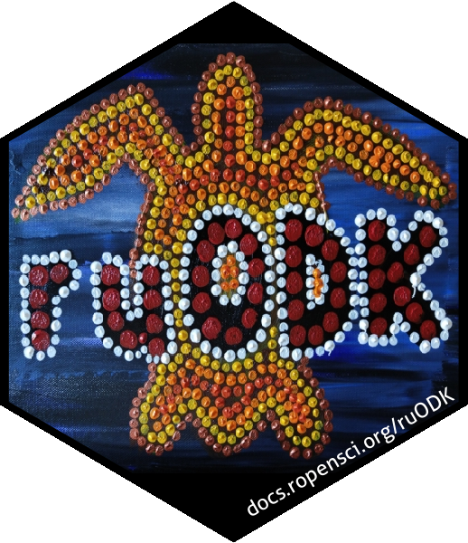

<!-- README.md is generated from README.Rmd. Please edit that file -->

```{r, include = FALSE}
knitr::opts_chunk$set(
  collapse = TRUE,
  comment = "#>",
  fig.path = "man/figures/README-",
  out.width = "100%",
  eval = FALSE
)
```

# urODK: A sing-along ruODK workshop 

<!-- badges: start -->
[](https://mybinder.org/v2/gh/dbca-wa/urODK/master?urlpath=rstudio)
<!-- badges: end -->

urODK is the companion package to [ruODK]((https://docs.ropensci.org/ruODK/)), 
an R client for the ODK Central API. urODK can be a starting point for new 
projects consuming data from ODK Central, or be used in a hands-on workshop.

In about one hour, we'll build an electronic data capture pipeline from form 
design to data analysis and dissemination using OpenDataKit and ruODK.

Before we start, read the brief [overview](https://docs.ropensci.org/ruODK/) of
electronic data capture using ODK, and how ruODK fits into that picture.

## Build a form <a href="#build"></a>
There are many ways to create a valid XForm. The friendliest way is to use
ODK Build, a drag-and-drop online form designer.

Reference: [ODK Build docs](https://docs.getodk.org/build-intro/)

* Sign up at [build.getodk.org](https://build.getodk.org/)
* [Build a form](https://docs.getodk.org/build-intro/#form-building), 
  save, [export as XML](https://docs.getodk.org/build-intro/#export-forms). 
  (10 min)
  
Dirty tricks:

* You can open ODK Build in more than one browser tabs.
* You can select (or shift-select several) widgets, then drag and drop them 
  between ODK Build forms.
* You can bulk-edit select1 options, paste from a spreadsheet, and save them for
  future re-use across forms.

Fail-safe: Use any of the 
[ruODK example forms](https://github.com/ropensci/ruODK/tree/master/inst/extdata).

## Distribute form
The Xform is distributed via ODK Central.

Reference: [ODK Central docs](https://docs.opendatakit.org/central-using/)

* Request an ODK Central account by invitation or by asking the workshop presenter (10 min pre workshop):
  * you'll need an email, which will become your ODK Central username
  * you'll receive a sign-up email with instructions to set up your ODK Central 
    password
* Create a project, create a form, upload the XML from ODK Build. (5 min)
* Create an app user on the project, open the QR code from "configure client".

Fail-safe: The presenter can show the QR code for an example project on the
ODK Central Sandbox.

## Collect data
Data collection happens on an Android device using ODK Collect.

Reference: [ODK Collect docs](https://docs.opendatakit.org/collect-using/)

* Install ODK Collect to your Android device from the Google Play Store. (5 min)
* Open ODK Collect > Menu > Admin Settings > Import Settings > Scan QR code.
* Get blank forms (1 min)

Data can now be captured and sent via WiFi or cellular network (see ODK Collect 
settings). (10 min)

Fail-safe: The presenter can bring a few pre-configured Android devices. The 
example forms already contain collected data.

## Analyse data <a href="#ru-ready-to-rock"></a>
Run through the steps shown in the first part of the README:

* Install ruODK. (10 min pre workshop)
* Configure ruODK through .Renviron (ODK Central Sandbox un,pw, default 
  project/form). (5 min)
* Create an Rmd from template "OData" and follow instructions within. (15 min)

### Install ruODK
* To run the ruODK workshop in a hosted, disposable RStudio instance, hit the 
  "binder" button.
* To install ruODK in your own environment, run this (preferably ahead of the 
  workshop to allow time for troubleshooting):

```{r quickstart}
if (!requireNamespace("remotes")) {install.packages("remotes")}
remotes::install_github('ropensci/ruODK@main',
                        dependencies = TRUE, ask=FALSE, update=TRUE)
```

### Configure ruODK
Get credentials (un, pw) for the given ODK Central instance and run the next 
chunk with the OData service URL. 

```{r configure}
ruODK::ru_setup(
  svc = "https://the-odata-svc-url/xxx.svc", 
  un = "me@email.com", 
  pw = "...",
  tz = "Australia/Perth", # your local timezone
  verbose = TRUE
)
```

Or add to `.Renviron` via `usethis::edit_r_environ()` (with your own un and pw):

```{r renviron}
ODKC_URL="https://myodkcentral.org"
ODKC_PID=14
ODKC_FID="my-form-id"
ODKC_UN="xxx"
ODKC_PW="xxx"
```

### Create a report
Start with a colour-by-numbers workflow example: 
If using RStudio, create a new RMarkdown workbook "from template" and select 
ruODK's template "ODK Central via OData", 
or run the next chunk with a filename of your choice:

```{r rmd_template}
rmarkdown::draft("my_example.Rmd", "odata", package="ruODK")
```

Follow the instructions in the workbook to explore the data.


## Contribute and develop
Instructions to extend or maintain urODK are given in the 
[contributing guide](https://github.com/dbca-wa/urODK/blob/master/.github/CONTRIBUTING.md).
Ideas, suggestions, bug reports and pull requests are welcome!
