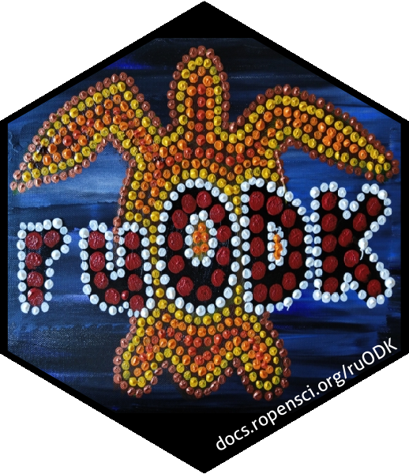

<!-- README.md is generated from README.Rmd. Please edit that file -->

# urODK: A sing-along ruODK workshop 

<!-- badges: start -->

[](https://mybinder.org/v2/gh/dbca-wa/urODK/master?urlpath=rstudio)
<!-- badges: end -->

urODK is the companion package to
[ruODK](\(https://dbca-wa.github.io/ruODK/\)), an R client for the ODK
Central API. urODK can be a starting point for new projects consuming
data from ODK Central, or be used in a hands-on workshop.

In about one hour, we’ll build an electronic data capture pipeline from
form design to data analysis and dissemination using OpenDataKit and
ruODK.

## Build a form <a href="#build"></a>

There are many ways to create a valid XForm. The friendliest way is to
use ODK Build, a drag-and-drop online form designer.

Reference: [ODK Build docs](https://docs.opendatakit.org/build-intro/)

  - Sign up at [build.opendatakit.org](https://build.opendatakit.org/)
  - [Build a
    form](https://docs.opendatakit.org/build-intro/#form-building),
    save, [export as
    XML](https://docs.opendatakit.org/build-intro/#export-forms). (10
    min)

Dirty tricks:

  - You can open ODK Build in more than one browser tabs.
  - You can select (or shift-select several) widgets, then drag and drop
    them between ODK Build forms.

Fail-safe: Use any of the [ruODK example
forms](https://github.com/dbca-wa/ruODK/tree/master/inst/extdata).

## Distribute form

The Xform is distributed via ODK Central. We’ll use the public sandbox.

Reference: [ODK Central
docs](https://docs.opendatakit.org/central-using/)

  - Request an account at the [ODK Central
    Sandbox](https://sandbox.central.opendatakit.org/#/login?next=%2F)
      - by asking
        \[@yanokwa\](<https://forum.opendatakit.org/u/yanokwa/summary>)
        on the [ODK Forum](https://forum.opendatakit.org/)
      - by asking the workshop presenter (10 min pre workshop)
      - you’ll need an email, which will become your ODK Central
        username
      - you’ll receive a sign-up email with instructions to set up your
        ODK Central password
  - Create a project, create a form, upload the XML from ODK Build. (5
    min)
  - Create an app user on the project, open the QR code from “configure
    client”.

Fail-safe: The presenter can show the QR code for an example project on
the ODK Central Sandbox.

## Collect data

Data collection happens on an Android device using ODK Collect.

Reference: [ODK Collect
docs](https://docs.opendatakit.org/collect-using/)

  - Install ODK Collect to your Android device from the Google Play
    Store. (5 min)
  - Open ODK Collect \> Menu \> Admin Settings \> Import Settings \>
    Scan QR code.
  - Get blank forms (1 min)

Data can now be captured and sent via WiFi or cellular network (see ODK
Collect settings). (10 min)

Fail-safe: The presenter can bring a few pre-configured Android devices.
The example forms already contain collected data.

## Analyse data <a href="#ru-ready-to-rock"></a>

Run through the steps shown in the first part of the README:

  - Install ruODK. (10 min pre workshop)
  - Configure ruODK through .Renviron (ODK Central Sandbox un,pw,
    default project/form). (5 min)
  - Create an Rmd from template “OData” and follow instructions within.
    (15 min)

### Install ruODK

To run urODK in a hosted, disposable RStudio instance, hit the “binder”
button. To install urODK in your own environment, run this (preferably
ahead of the workshop):

``` r
if (!requireNamespace("remotes")) {install.packages("remotes")}
remotes::install_github("dbca-wa/ruODK", force = T, dependencies = T, upgrade = "ask")
remotes::install_github("dbca-wa/urODK", force = T)
```

### Configure ruODK

Get credentials (un, pw) for the given ODK Central instance and run the
next chunk with the OData service URL. Note: the `paste0()` is cosmetic
and optional.

``` r
ruODK::ru_setup(
  svc = paste0("https://sandbox.central.opendatakit.org/v1/projects/14/",
               "forms/build_Flora-Quadrat-0-4_1564384341.svc"), 
  un = "me@email.com", 
  pw = "..."
)
```

Or add to `.Renviron` via `usethis::edit_r_environ()` (with your own un
and pw):

``` r
ODKC_URL="https://sandbox.central.opendatakit.org"
ODKC_PID=14
ODKC_FID="build_Flora-Quadrat-0-4_1564384341"
ODKC_UN="xxx"
ODKC_PW="xxx"
```

### Create a report

Start with a colour-by-numbers workflow example: If using RStudio,
create a new RMarkdown workbook “from template” and select ruODK’s
template “OData”, or run the next chunk with a filename of your choice:

``` r
rmarkdown::draft("my_example.Rmd", "odata", package="ruODK")
```

Follow the instructions in the workbook to explore the data.
